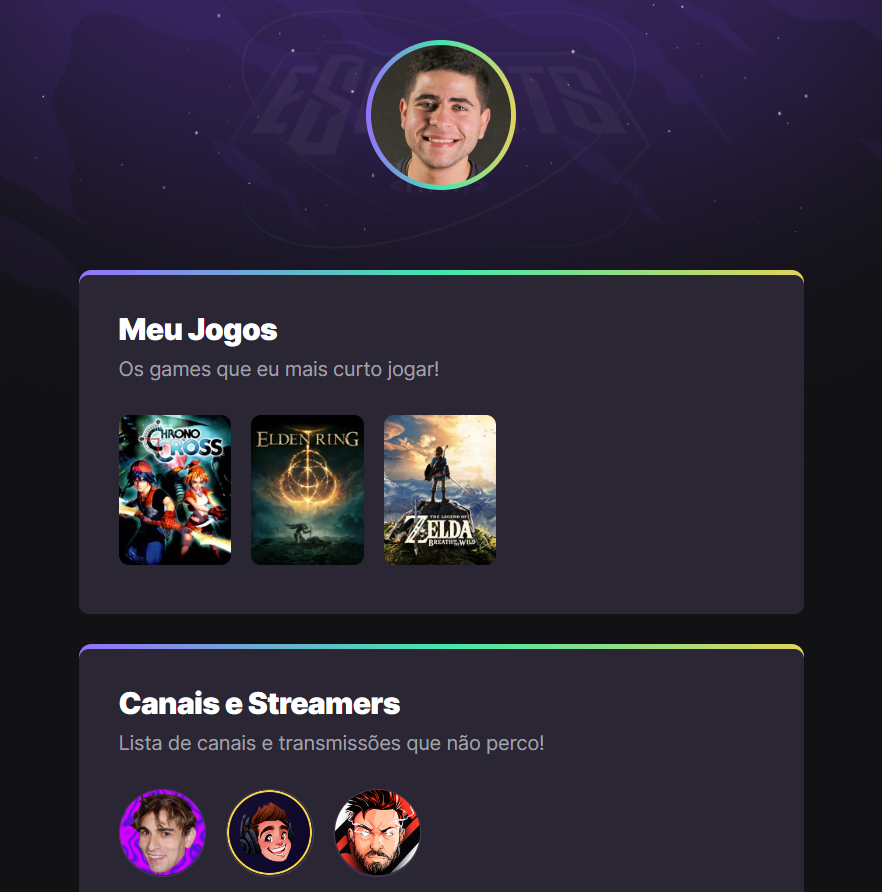

# NLW eSports

> Trilha Explorer

Projeto construído no evento Next Level Week da Rocketseat

[🔗Acesse a página aqui](https://rodrigodyho.github.io/NLW-eSports-Explorer/)

## ⚒️Tecnologias

- HTML
- CSS
- Git & GitHub

## 📈Métricas

##### (Fora do escopo do evento)

- Google Tag Manager
- Analytics

## 💡O que aprendi com este projeto?

Tive a oportunidade de aprender a lidar melhor com estilização de imagens, efeitos em elementos e formas inteligentes de usar o HTML ao favor do CSS.
Mas talvez o mais significativo foi aprender a usar o README.md, ao final essa é a primeira vez que faço uso dessa função.

## 📧Contato

rodrigodyho@gmail.com
